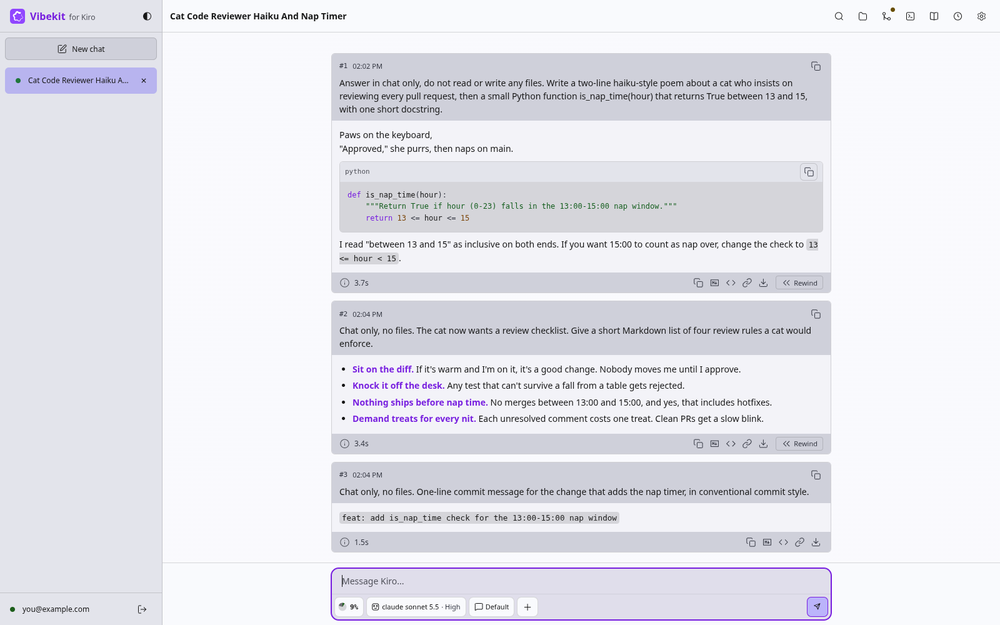

# marotte

[](https://github.com/cplieger/marotte/pkgs/container/marotte)   [](https://github.com/cplieger/marotte/issues?q=label%3Agremlins-tracker) [](https://github.com/cplieger/marotte/releases)

<!-- hub-overview BEGIN -->
marotte puts Kiro in your browser as a self-hosted agentic IDE. Chat with the Kiro agent, `kiro-cli`, from a phone or a desktop, with a file editor, a terminal and git in the same tab.



## ⚠️ Alpha software

marotte is in alpha. Any update can change how it works, or how chats and settings are stored, without converting yours. Pin an image tag from the [releases](https://github.com/cplieger/marotte/releases) instead of `latest`, and read the release notes before you upgrade.

## What it does

marotte lets you write and ship code with the Kiro agent from any device, while your repositories and chats stay on your own server.

- Pick up the same conversation on every screen, your phone included.
- Review a whole turn's file edits before you keep them, or rewind a chat and its edits.
- Edit files, use a terminal, and commit and open pull requests on GitHub, GitLab, Codeberg or Gitea.
- Install language servers and command-line tools from a catalog of about 900.
- Get notified when the agent finishes or needs approval.

## Who it is for

marotte is built for a developer who wants a full Kiro workspace on a server they run, in any browser. Start a task at your desk, then follow it and answer the agent from your phone. One container is one person's workspace.

You need a Kiro account and an `amd64` or `arm64` Docker host. marotte has no login of its own, so keep it on your private network or behind a reverse proxy with a login.

Consider [Web Terminal for Kiro](https://github.com/cplieger/web-terminal-kiro), by the same author, if you want kiro-cli's own terminal screen with no chat layer.

marotte is free software under the AGPL-3.0-or-later license.
<!-- hub-overview END -->

## Quick start

The image is on GitHub Container Registry and Docker Hub, for `amd64` and `arm64`. This is the [`compose.yaml`](compose.yaml) in this repository.

```yaml
services:
  marotte:
    image: ghcr.io/cplieger/marotte:latest
    container_name: marotte
    restart: unless-stopped
    # Create the three host folders below and run "sudo chown -R 1000:1000 /opt/appdata/marotte"
    # before the first start, or the container restarts in a loop. If .env sets PUID and PGID, use those numbers.
    user: "${PUID:-1000}:${PGID:-1000}"

    ports:
      - "9847:9847"  # keep this port on your own network, see README "Security"

    volumes:
      - "/opt/appdata/marotte/config:/config"  # chats, the Kiro sign-in, installed tools
      - "/opt/appdata/marotte/workspace:/workspace"  # your repositories
      - "/opt/appdata/marotte/uploads:/uploads"  # files you attach to a message
```

1. Create the folders with `sudo mkdir -p /opt/appdata/marotte/config /opt/appdata/marotte/workspace /opt/appdata/marotte/uploads`.
2. Give them to user 1000 with `sudo chown -R 1000:1000 /opt/appdata/marotte`. If you set `PUID` and `PGID` in `.env`, use those numbers.
3. Run `docker compose up -d`.
4. Open `http://<server>:9847`, where `<server>` is the address of the server on your network, for example `http://192.168.1.10:9847`.
5. Sign in with your Kiro account when the page asks. Chats use that account's plan and credits, which the sidebar shows.

The first start downloads kiro-cli, about 530 MB, which can take a few minutes. The page, files, git and the terminal work in the meantime, and chats say kiro-cli is still installing. Amazon publishes kiro-cli under the AWS Customer Agreement. marotte downloads it instead of shipping it in the image, so starting the container means you accept that agreement.

Run `docker logs marotte`. After the download you should see `msg=installed package=kiro-cli`. If you see `failed to create required directories`, step 2 was skipped.

## Using it from a phone

Open the same address in your phone's browser and add it to the home screen to install it as an app. Notifications for a finished turn or workflow run, a pull request's checks, or a permission request then arrive with the tab closed. Browsers allow both only over HTTPS or on `localhost`, so a phone needs the reverse proxy from [Security](#security). The other features are in [Features](docs/features.md).

## Configuration reference

Settings in the compose `environment:` block are read at start, so recreate the container after a change. Models, permissions, tools, notifications and chat retention are set on the page under **Settings** instead. No variable is required.

| Variable | Description | Default |
| --- | --- | --- |
| `ALLOWED_HOSTS` | Hostnames and IPs you open marotte at, comma-separated. Any other address gets `403`. | _(unset)_ |
| `TRUSTED_PROXIES` | Address ranges of your reverse proxy, so the logs record the real client address. | _(unset)_ |
| `TRUSTED_INSTALL_UIDS` | User IDs that may write to `/config/tools` without marotte refusing to install kiro-cli. Only for shared or network volumes. | _(unset)_ |
| `MAROTTE_BROWSE_ROOTS` | Extra folders the file browser shows, colon-separated absolute paths. | _(unset)_ |
| `MAROTTE_AGENT_WORKFLOWS` | Whether the agent can start workflow runs itself. | `true` |
| `MAROTTE_ALLOW_AGENT_ENV` | Program-changing variables, such as `LD_PRELOAD`, the agent may set for its commands. | _(unset)_ |
| `MAROTTE_ALLOW_BRIDGE_ENV` | Variable names that look like credentials but should still reach kiro-cli, comma-separated. | _(unset)_ |
| `MAROTTE_KIRO_ACP_ARGS` | Extra `kiro-cli acp` flags for every chat. | _(unset)_ |

Every setting, with what each one checks, is in [Configuration](docs/configuration.md).

| Mount | Description |
| --- | --- |
| `/config` | Chats, the kiro-cli sign-in and install, installed tools and settings |
| `/workspace` | Your repositories, and where chats and the terminal start |
| `/uploads` | Files you attach to a message. Without a volume they are lost when the container is recreated |

| Port | Description |
| --- | --- |
| `9847` | The web page, its live updates and the terminal |

## Security

marotte has no login of its own. Anyone who can reach port 9847 can use the agent, which runs commands and edits files under `/workspace`, and the Kiro sign-in in `/config`. Keep the port on your private network, or put marotte behind a [reverse proxy](https://github.com/cplieger/docs/blob/main/docs/reverse-proxy.md) that asks for a login, such as Caddy forward-auth, oauth2-proxy or Authentik. Signing in on the page signs kiro-cli in to your Kiro account, not marotte itself.

Set `ALLOWED_HOSTS` on any server that stays up. marotte then answers only at the addresses you list, so another website cannot use your browser to reach it.

The agent can read the container's `environment:`. marotte drops names ending in `_TOKEN` or `_SECRET` and the AWS key pair, so keep other credentials out of it.

marotte sends no telemetry, and kiro-cli's own telemetry starts off. [Security](docs/hardening.md) covers the container user, tool installs and how kiro-cli is verified.

## Troubleshooting

Docker checks `/api/health` every 30 seconds. The container shows healthy once marotte is up and kiro-cli is installed and working, and the first start gets five minutes for the download. While it shows unhealthy the page still works and only chats wait. Docker does not restart a container because it is unhealthy.

- The container restarts in a loop with `failed to create required directories`. The host folders are missing or belong to another user. Repeat steps 1 and 2 of the quick start.
- Health stays at `kiro-cli install retrying` or `kiro-cli unavailable`. The download failed. marotte tries four times, then waits for a container restart.
- The logs say a folder under `/config` "can be modified by" another account. This happens on shared or network volumes. See `TRUSTED_INSTALL_UIDS` in [Configuration](docs/configuration.md#trusted-install-accounts-trusted_install_uids).
- The page answers `403`. The address you typed is not in `ALLOWED_HOSTS`.

## Documentation

- [Features](docs/features.md) describes every part of the page, knowledge bases included.
- [Configuration](docs/configuration.md) lists every setting and what it checks.
- [Security](docs/hardening.md) covers tool installs, the image and the kiro-cli install.
- [How marotte works](docs/how-it-works.md) explains syncing across devices and how kiro-cli is installed and repaired.
- [Launch flags](docs/launch-flags.md) and [OS packages](docs/os-packages.md) cover two less common setups.

## Credits

marotte drives [kiro-cli](https://kiro.dev/docs/cli/), the Kiro agent, which the container downloads on first start. The terminal is built on [web-terminal-engine](https://github.com/cplieger/web-terminal-engine). Chat search ranking, the approval timeout for scheduled runs and the ladder of permission profiles follow [Kiro Crew](https://github.com/kirodotdev/KiroCrew).

## Contributing

See [CONTRIBUTING.md](CONTRIBUTING.md).

## Disclaimer

This project is built with care and follows security best practices, but it is intended for personal / self-hosted use. No guarantees of fitness for production environments. Use at your own risk.

This project was built with AI-assisted tooling using [Claude](https://claude.com), [GPT](https://openai.com), and [Kiro](https://kiro.dev). The human maintainer defines architecture, supervises implementation, and makes all final decisions.

## License

AGPL-3.0-or-later. See [LICENSE](LICENSE). The image carries the license text of every bundled component under `/usr/share/licenses/`.

The terminal's two web fonts ship under their own licences, each licence text served beside the font files under `/vendor/fonts/`: [Monaspace](https://github.com/githubnext/monaspace) Neon NF under SIL Open Font License 1.1, and [web-terminal-glyphs](https://github.com/cplieger/web-terminal-glyphs) under Apache-2.0.
